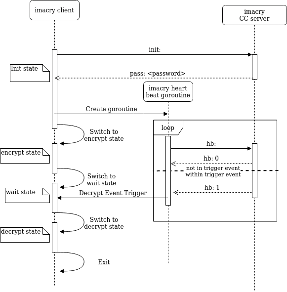

# Architecture
**This document describes the high-level architecture of this project**

If you want to familiarize yourself with the code base and *generally* how it works, this is a good place to be.

## High Level TLDR
<DESCRIPTION>

## Sequence Diagram

## Code Map

#### Code Map Legend

`<file name>` for a file name

`<folder name>/` for a folder

`<folder name>/<file name>` for a file within a folder

### `<EXAMPLE>`

example description

